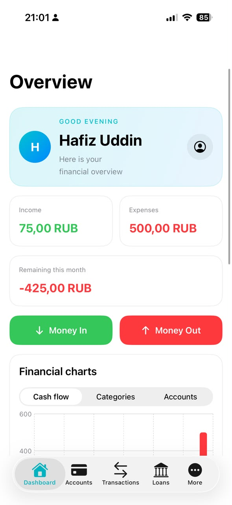
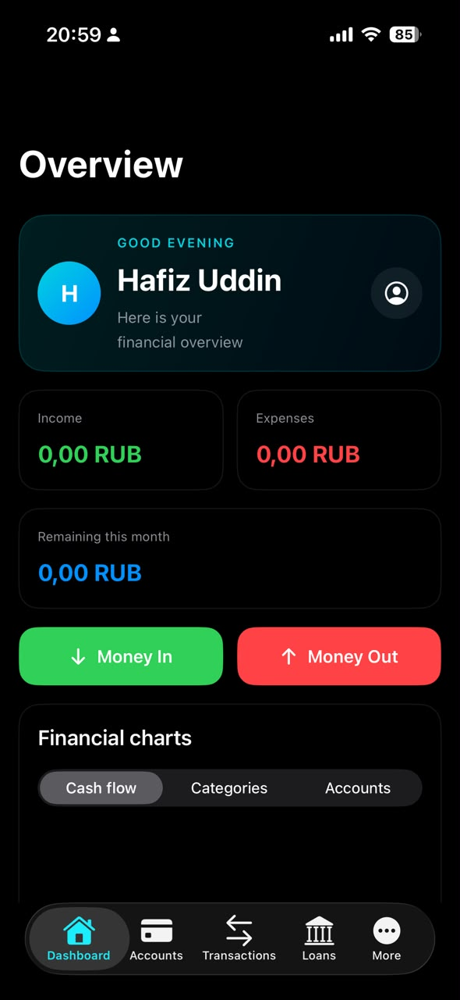
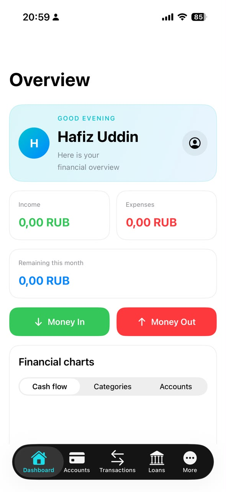
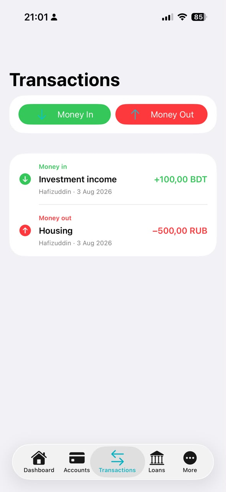
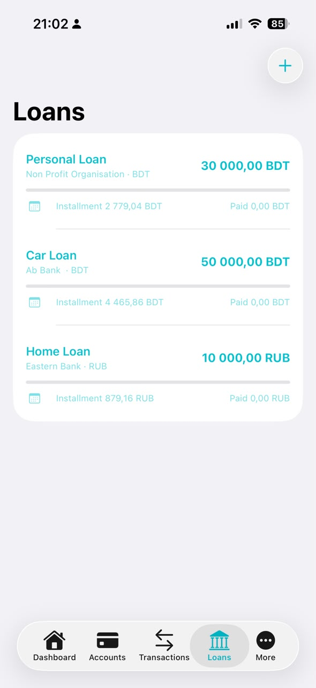

# Nomad Wealth iOS

Nomad Wealth is a native SwiftUI personal finance application for managing accounts, income, expenses, budgets, loans and multiple currencies.

## Screenshots

### Dashboard

### Dashboard

### Accounts

### Transactions

### Loans

### Profile

## Features

- Native SwiftUI interface
- Supabase authentication
- Multi-currency accounts
- Income and expense tracking
- Financial charts
- Budgets
- Loans and installment tracking
- Dark and light mode

## Developer

Developed by Hafizuddin
